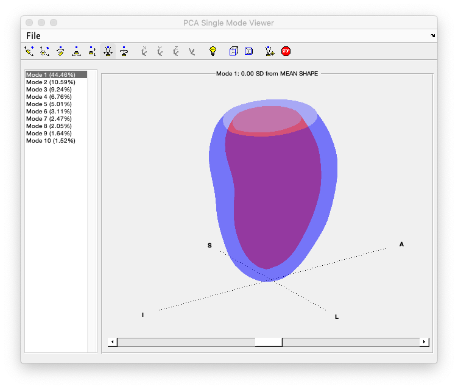

# PCATool

This MATLAB tool shows interactive GUI of the first 10 Principal Component Analysis (PCA) modes of variations derived from 1,991 MESA models as described in http://www.cardiacatlas.org/tools/lv-shape-static-modes/



## PCA for the End Diastolic shape

```
>> PCAEDModeViewer
```

## PCA for the End Systolic shape

```
>> PCAESModeViewer
```
